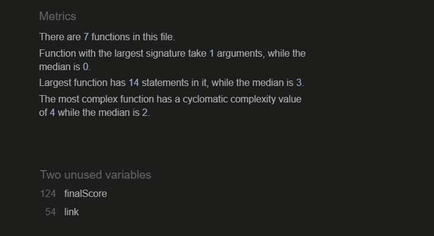

# MATH QUIZ

https://aron-m.github.io/SLIGO-POD-HOUSE-RENTAL-MOBILE-FIRST/

MATH QUIZ is a web application designed to test a user's knowledge in addition-based mathematics by presenting a multiple choice quiz, consisting of 5 questions, each containing 3 options as answers. The user must attempt to answer as many questions correctly to test their aptitude.

## User Experience (UX)
## User Stories

* As user visiting the website I want to be able to participate in a math-based quiz
* As user visiting website I want to navigate easily through the website.
* As user I want to see rules or instructions how to use and navigate through the application.
* As user I want to see landing page and navigate through it.
* As a user I want to clearly see the various questions asked, together with various options to choose the answer from.
* As user I want to see my score after I have finished the quiz.
* As user I want to revert back to the home page once I am done with the quiz

# Website Goals
* Create a quiz based challenge for the user
* Provide various multiple choice questions
* Include a variety of options too choose an answer from.
* The difficulty of the questions to increase with each following question.
* Have the user be able to answer all questions in succession.
* Provide the user with a final score.
* Let the user be able to revert back to the start if they choose to do the quiz again.

### Design
#### Colors:

* Colors used on the website are:

*  rgb(35, 35, 146); dark blue

*  rgb(35, 161, 64); green

*  rgb(22, 106, 78); dark green

* White #ffffff;

#### Fonts:

Fonts used on website are 'Slackey' and 'Bubblegum-Sans' from google fonts. 
Backup fonts is sans-serif if main font cannot be loaded for any reason.

#### Images:

Only one image has been used. A cartoon professor was used for the home page.

Website structure

| Screen size | Breakpoint |
|---|---|
|small   |>= 350px (mobile-first design)|
|large	 |>= 830px|

Back to top

## Technology, Frameworks and Programs used.
### Languages

* HTML

* CSS

* JavaScript

#### Frameworks and Programs used.

Google fonts was used to pick and import fonts to my project.

* GitHub

GitHub was used to store my source code by git add . git commit and git push.

* Git

Git was used with GitPod to write down the code and push it to GitHub.

* Screenfly

Testing website.
Features
Responsive on all devices.
Interactive buttons

* Fontawesome

Fontawesome was used to obtain various icons used within the website, such as within the the INCLUDING section as well as THINGS TO DO section of the page.

* Am I Responsive

To test various screen-size responsiveness.

# SECTIONS OF WEBSITE

1. Home/Landing Page section
2. Question 1
3. Question 2
4. Question 3
5. Question 4
6. Question 5
7. Final page congartulating the user and showing final score

## Home/Landing Page

 - Home page will be the first window on display, showing the name of the quiz followed the rules and instructions and lastly a button to click, which toggles the start of the quiz.

    </img>

    - START BUTTON:

     

        PLEASE NOTE: Color of button turns orange when hovered over

    
 
 
 
 
 

## Questions 1,2,3

QUESTION 1 | QUESTION 2 | QUESTION 3
 :---:|:---:|:---:
  |  | 

 - Color of the option buttons turn blue once hovered over, as showed in question 1.

## Questions 4,5

QUESTION 4 | QUESTION 5 
 :---:|:---:
  |  

- Notice how the difficulty of the questions increment with each passing question

- Once user clicks an answer for question 5, the page will be redirected to the final page.

## Final Page

FINAL PAGE | FINAL PAGE ERROR
 :---:|:---:
  | 

* Final page shows a congratulations message and also *should* display the user's final score.
* At the bottom, the 'back to home' button will redirect the user back to the home page.
* Notice that 'back to home' button wil turn black when hovered over.

### ERROR!
* On the right hand side screenshot of final page you will see there is no score displayed.
This is because I was not able to figure out how to do it. JavaScript is still too dificult for me and I ran out of time trying to figure out everything I needed to do for this project.

 
 
 
 
 

## FOR MOBILE (360px-740px)

HOME PAGE | QUESTION PAGE | FINAL PAGE
 :---:|:---:|:---:
  |  | 

* All images flows top-down
* App designed for Samsung Galaxy S8+ and bigger

 
 
 

## FOR TABLET (830px-1140px)

HOME PAGE | QUESTION PAGE | FINAL PAGE
 :---:|:---:|:---:
  |  | 

* Layout is fairly similar to full screen layout

 
 
 

## TESTING

As shown previously, there was a big bug regarding the final score not showing

* I have since done extensive research and figured out how to add the final score.
* Validation has been done on both the CSS, with W3Schools, and for JavaScript with JSHint
* On this occasion there is no known bugs and all validators show that the code is running without any errors.

#### VALIDATOR

Validator JSHint shows no errors however only two warnings of unused functions.

 
 
 

# Deployment
Following writing the code then commiting and pushing to GitHub, this project was deployed using GitHub by the following steps.

1. Navigate to the repository on github and click **Settings**.
2. Then select **Pages** on the side navigation.
3. Select the None dropdown, and then click **Main**.
4. Click on the **Save** button.
5. Now the website is now live on 
6. If any changes are required, they can be done, commited and pushed to GitHub and the changes will be updated.

# Credits:

- Slack Community member Matt Bodden and Daisy_mentor for selflessly helping me with queries and questions.

- [Fontawesome](https://fontawesome.com/kits) for icons.
- [The W3C CSS Validation Service](https://jigsaw.w3.org/css-validator/) Validation of CSS.
- [JS Hint](https://jshint.com/) validating code for JS script file.
- [AmIresponsive](https://ui.dev/amiresponsive) for responsive look of my website.
- Youtube

